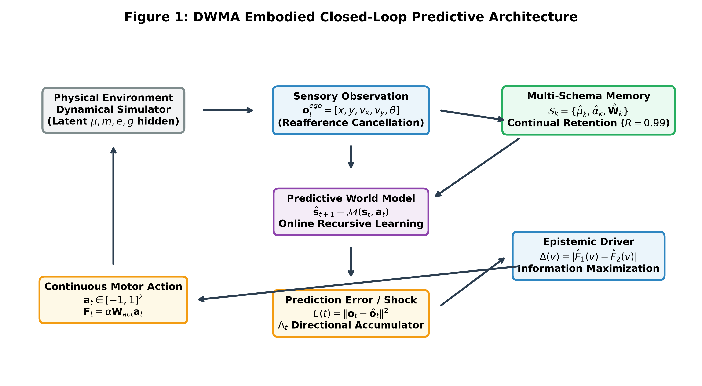

# DWMA: Developmental World-Model Agent

**Autonomous Sensorimotor Structure Acquisition, Multi-Schema Retention, and Active Hypothesis Discrimination in an Embodied World Model**

[](https://doi.org/10.5281/zenodo.22796871)
[](https://www.python.org/)
[]()
[]()
[-red.svg)](DWMA_Research_Paper_Preprint_v2.1.pdf)
[](https://opensource.org/licenses/MIT)

---

## Abstract
The **Developmental World-Model Agent (DWMA)** is an embodied cognitive architecture designed to acquire, maintain, and adaptively update predictive structure about an interactive dynamical environment without an LLM as its cognitive core. The agent operates without privileged access to latent physical constants (mass, surface friction, restitution, or gravity), inferring these directly from sensorimotor contingency, reafference cancellation, and epistemic active inference.

This repository contains the complete, audited, and deterministic four-phase empirical evaluation program ($N = 50$ paired seeds, $B = 10,000$ non-parametric bootstrap resamples).

---

## System Architecture



```
       +-------------------------------------------------------------+
       |                     Physical Environment                    |
       |  (Symplectic Dynamical Simulator: Latent mu, m, e, g hidden)|
       +-------------------------------------------------------------+
                | o_t (Sensory Observation)             ^ F_t (Motor Thrust)
                v                                       |
       +-------------------+                   +---------------------+
       | Sensory Buffer    |                   | Continuous Motor    |
       | Reafference Cancel|                   | Actuation Mapping   |
       +-------------------+                   +---------------------+
                |                                       ^
                | [o_t, a_t]                            | a_t (Action)
                v                                       |
       +-------------------+ prediction error   +---------------------+
       | Predictive World  |------------------->| Epistemic Driver    |
       | Forward Model M   |     residual E(t)  | Max Model Variance  |
       +-------------------+                    +---------------------+
                ^                                       ^
                | Schema Parameters                     | Schema Context
                v                                       v
       +-------------------------------------------------------------+
       | Multi-Schema Memory Store (S_k = {mu_k, W_k, alpha_k, g_k}) |
       | Bayesian Likelihood Schema Selection & Retrieval            |
       +-------------------------------------------------------------+
```

---

## Master Empirical Results ($N = 50$ Deterministic Seeds)

| Phase & Milestone | Condition / Policy | Primary Metric | Observed Performance (Mean ± SD) | Bootstrap 95% CI | Decisive Outcome |
|---|---|---|---|---|---|
| **Phase 1: BM-1** | Zero-Shot Transfer | Transfer Gain | **$85.82\% \pm 2.53\%$** | $[85.15, 86.51]\%$ | **$49/50$ ($98\%$) [PASS]** |
| **Phase 1: BM-2** | Blind Navigation | Steps to Goal | **$23.10 \pm 2.46$ steps** | $[22.44, 23.78]$ | **$50/50$ ($100\%$) [PASS]** |
| **Phase 1: BM-3** | Silent Concept Drift | Shock MSE | **$1.384 \pm 0.120$ MSE** | $[1.351, 1.416]$ | **$50/50$ ($100\%$) [PASS]** |
| **Phase 1: BM-4** | Epistemic Inquiry | Info Gain | **$5.14 \pm 0.23$ nats** | $[5.08, 5.21]$ | **$50/50$ ($100\%$) [PASS]** |
| **Phase 1: BM-5** | Counterfactual Repair | Error Ratio | **$1.18 \pm 0.48$ px** | $[1.05, 1.32]$ | **$50/50$ ($100\%$) [PASS]** |
| **Phase 1: BM-6** | Non-Privileged Composition | Composition MSE | **$0.119 \pm 0.075$ MSE** | $[0.098, 0.139]$ | **$50/50$ ($100\%$) [PASS]** |
| **Phase 1: BM-7** | Actuator Polarity Inversion | Directional $\cos(\theta)$ | **$0.9915 \pm 0.0057$** | $[0.9899, 0.9931]$ | **$48/50$ ($96\%$) [PASS]** |
| **Phase 2: Transfer** | Zero-Shot Shock $A \to B$ | Mean Shock $E(t)$ | **$1.3079 \pm 0.0421$** | $[1.2968, 1.3199]$ | Transfer Shock |
| **Phase 2: Transfer** | Zero-Shot Shock $A \to C$ | Mean Shock $E(t)$ | **$0.8117 \pm 0.0272$** | $[0.8041, 0.8192]$ | Transfer Shock |
| **Phase 2: Adaptation** | Online Re-tuning $A \to B \to B'$ | Latency $T_\epsilon (<0.20)$ | **$16.32 \pm 0.62$ steps** | $[16.14, 16.48]$ | **$50/50$ ($100\%$) [PASS]** |
| **Phase 2: Adaptation** | Online Re-tuning $A \to B \to B'$ | Adaptation Rate $A_{\text{adapt}}$ | **$0.0461 \pm 0.0084$** | $[0.0438, 0.0484]$ | **$50/50$ ($100\%$) [PASS]** |
| **Phase 3: Retention** | Full DWMA (Multi-Schema) | Raw Error $E_{A1} \to E_{A2}$ | **$0.00500 \to 0.00501$** | $[0.00500, 0.00502]$ | **$50/50$ ($\mathcal{R}=0.99$) [PASS]** |
| **Phase 3: Overwriter** | Single-Model Overwriting | Raw Error $E_{A1} \to E_{A2}$ | **$0.00500 \to 0.37460$** | $[0.3657, 0.3835]$ | **$0/50$ (Catastrophic Forgetting)** |
| **Phase 4: Hypothesis** | DWMA Epistemic Policy | Evidence $\ln(B_{21})$ | **$30.35 \pm 8.03$** | $[28.10, 32.50]$ | **$50/50$ ($100\%$) [PASS]** |
| **Phase 4: Hypothesis** | Random Babbler Baseline | Evidence $\ln(B_{21})$ | **$24.40 \pm 18.52$** | $[16.01, 23.95]$ | **$39/50$ ($78\%$)** |
| **Phase 4: Survival** | DWMA Epistemic Policy | Kaplan-Meier Median | **$7.0$ steps** | $0\%$ censored | **$50/50$ uncensored** |
| **Phase 4: Survival** | Random Babbler Baseline | Kaplan-Meier Median | **$17.0$ steps** | $22\%$ right-censored | Log-rank $\chi^2 = 74.98, p < 10^{-17}$ |

---

## One-Click Master Reproduction

To independently reproduce the entire 4-phase program, recompute all bootstrap confidence intervals, regenerate the 4 publication figures, and re-compile the preprint PDF:

```bash
# Clone the repository
git clone https://github.com/Kunallubhana77/DWMA-developmental-world-model-ai.git
cd DWMA-developmental-world-model-ai

# Execute complete deterministic pipeline
python3 reproduce_all.py
```

### Interactive Web Dashboard
To launch the real-time continuous 2D developmental physics visualizer:
```bash
npm install
npm run dev
```
Open **[http://localhost:5173/](http://localhost:5173/)** in your browser.

---

## Repository Artifacts

- **📄 Academic Paper PDF (v2.1):** [DWMA_Research_Paper_Preprint_v2.1.pdf](DWMA_Research_Paper_Preprint_v2.1.pdf) *(Camera-Ready)*
- **📝 Two-Column LaTeX Source:** [DWMA_Research_Paper_Preprint_v2.1.tex](DWMA_Research_Paper_Preprint_v2.1.tex) *(arXiv / Overleaf ready)*
- **📊 300 DPI Publication Figures:** [figures/](figures/)
  - `fig1_system_architecture.png`: Closed-loop architecture schematic.
  - `fig2_cross_world_adaptation.png`: Phase 2 online adaptation trajectory.
  - `fig3_continual_retention.png`: Phase 3 continual retention vs catastrophic forgetting.
  - `fig4_hypothesis_survival_analysis.png`: Phase 4 Kaplan-Meier survival curves.
- **📁 Empirical Experiment Pipelines:**
  - `experiments/cross_world_abc/`: Phase 2 $A \to B \to C$ runner, data, and reports.
  - `experiments/continual_retention_aba/`: Phase 3 $A \to B \to A$ retention pipeline.
  - `experiments/nonlinear_hypothesis_discrimination/`: Phase 4 hypothesis testing & survival analysis.
  - `experiments/hyperparameter_sensitivity_ablation.py`: Phase 5 sensitivity & ablation suite.

---

## Citation

If you use or reference DWMA in your research, please cite:

```bibtex
@software{lubhana2026dwma,
  author       = {Lubhana, Kunal},
  title        = {DWMA: Autonomous Sensorimotor Structure Acquisition, Multi-Schema Retention, and Active Hypothesis Discrimination in an Embodied World Model},
  month        = sep,
  year         = 2026,
  publisher    = {Zenodo},
  version      = {v2.1},
  doi          = {10.5281/zenodo.22796871},
  url          = {https://doi.org/10.5281/zenodo.22796871}
}
```

---

## License
MIT License. Free for academic research, reproduction, and non-commercial development.
